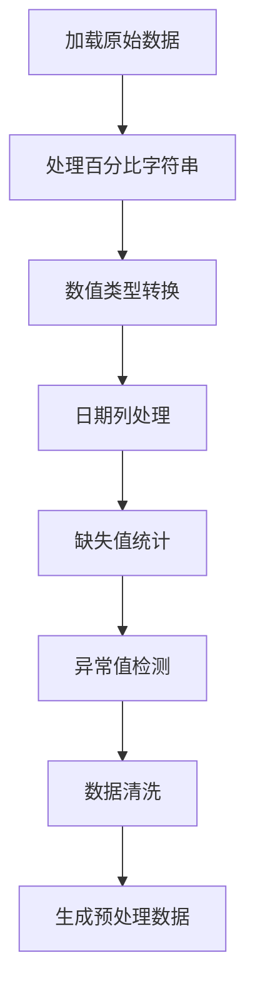
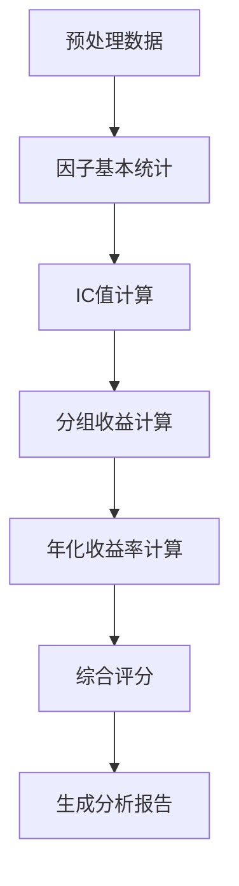

# 因子分析代码结构分析报告

## 1. 总体概述

### 1.1 程序概述
`yihnzifenxi1119.py`是一个专业的因子分析程序，专门用于创业板单日下跌14%详细交易日数据的量化分析。该程序提供了完整的因子分析流程，包括数据预处理、IC值计算、分组收益分析、统计检验和报告生成。

### 1.2 主要功能特点
- **多因子支持**：支持7个核心因子同时分析
- **稳健统计方法**：包含多种稳健性统计和异常值检测
- **IC值计算**：支持Spearman和Pearson相关系数
- **分组收益分析**：支持5等分和10等分分组方式
- **数据可视化**：支持因子分布图和分组收益图
- **报告生成**：支持多种格式的详细分析报告
- **带参数因子分析**：支持参数优化和敏感性分析

### 1.3 数据来源
- 主要数据文件：`创业板单日下跌14%详细交易日数据（清理后）1114.xlsx`
- 收益率列：`持股2日收益率`
- 支持因子：7个核心因子包括上市天数、跌幅百分比等

## 2. 代码架构设计

### 2.1 主要组件结构

```
yihnzifenxi1119.py
├── 导入模块与依赖库
├── 日志记录系统
├── 统计方法辅助函数
├── 因子分析核心类
├── 图形可视化功能
└── 报告生成系统
```

### 2.2 核心类设计

#### 2.2.1 Logger类 - 日志记录系统
**功能**：提供双输出日志记录功能
```python
class Logger:
    def __init__(self, log_file=None)  # 初始化日志记录器
    def write(self, message)           # 同时输出到终端和日志文件
    def flush(self)                    # 刷新输出
    def close(self)                    # 关闭日志记录器
```

**特点**：
- 自动生成带时间戳的日志文件
- 同时输出到控制台和文件
- 支持中文编码（UTF-8）

#### 2.2.2 FactorAnalysis类 - 因子分析核心类
**属性**：
- `file_path`：数据文件路径
- `data`：原始数据框
- `processed_data`：预处理后数据
- `factors`：因子列表
- `return_col`：收益率列名
- `analysis_results`：分析结果存储

**核心方法**：

1. **数据预处理方法**：
```python
def preprocess_data(self, process_factors=False, factor_method='standardize', winsorize=True)
```
- 处理百分比字符串转换
- 数据类型转换
- 缺失值处理
- 异常值检测

2. **IC值计算方法**：
```python
def calculate_ic(self, factor_col, use_pearson=False, use_robust_corr=False)
```
- 支持Spearman和Pearson相关系数
- 包含异常值检测和敏感性分析
- 动态筛选策略（高/中/低样本量模式）
- 稳健性统计方法

3. **分组收益计算方法**：
```python
def calculate_group_returns(self, factor_col, n_groups=5)
```
- 支持5等分和10等分分组
- 等分分组方式（简单排序平均分配）
- 计算年化收益率、风险指标
- 自适应年化计算系统

4. **因子统计方法**：
```python
def calculate_factor_stats(self, factor_col)
```
- 基本统计量计算
- 异常数据统计指标
- IQR离群值检测
- 偏度峰度分析

#### 2.2.3 ParameterizedFactorAnalyzer类 - 带参数因子分析器
**功能**：专门针对带参数因子的综合分析
- 10等分测试
- 参数优化
- 综合指标计算
- 生成详细TXT报告

## 3. 核心算法实现

### 3.1 IC值计算算法

#### 3.1.1 自定义Spearman相关系数
```python
def custom_spearman_corr(x, y):
    # 1. 数据预处理（移除NaN和无穷值）
    # 2. 秩计算（处理重复值）
    # 3. 皮尔逊相关系数计算
    # 4. 范围校正
```

**特点**：
- 不依赖scipy.stats
- 正确处理重复值
- 数值稳定性优化

#### 3.1.2 动态样本筛选策略
```python
# 根据平均每日样本数量选择筛选方式
if avg_daily_samples >= 5:
    min_samples_per_day = 5
    mode = "高样本量模式"
elif avg_daily_samples >= 3:
    min_samples_per_day = 3
    mode = "中样本量模式"
else:
    min_samples_per_day = 2
    mode = "低样本量模式"
```

### 3.2 年化收益率计算

#### 3.2.1 标准复利年化方法
```python
def calculate_standard_annual_return(total_return_rate, observation_years, method='standard_compound'):
    # 标准复利年化: (1 + 总收益率)^(1/年数) - 1
    # 对数方法: exp(ln(1+总收益率)/年数) - 1（数值稳定性更好）
```

**算法特点**：
- 优先使用标准复利年化方法（数学最严谨）
- 保留CAGR方法作为对比验证
- 删除线性年化方法（忽视复利效应）
- 增强数据特征分析和验证机制

#### 3.2.2 自适应年化计算
```python
def _analyze_data_characteristics(self):
    # 1. 自动分析原始数据特征
    # 2. 基于数据特征选择最优年化算法
    # 3. 执行年化计算
```

### 3.3 稳健性统计方法

#### 3.3.1 异常值检测
```python
def detect_outliers(x, method='iqr'):
    # IQR方法：Q1-1.5*IQR 到 Q3+1.5*IQR
    # Z-score方法：|z| > 3
    # Modified Z-score方法：|修改Z| > 3.5
```

#### 3.3.2 敏感性分析
```python
def sensitivity_analysis(x, y, outlier_methods=['iqr', 'zscore']):
    # 包含vs剔除异常值的对比
    # 计算敏感性指标
```

#### 3.3.3 多重检验校正
```python
def false_discovery_control(p_values, method='bh', alpha=0.05):
    # Benjamini-Hochberg方法（BH校正）
    # Benjamini-Yekutieli方法（BY校正，更保守）
```

### 3.4 滚动窗口分析
```python
def rolling_window_analysis(df, factor_col, return_col, window_sizes=[30, 60]):
    # 滚动窗口IC值计算
    # IC衰减分析
    # 稳定性指标计算
```

## 4. 数据处理流程

### 4.1 数据预处理流程


### 4.2 因子分析流程


### 4.3 评分体系

#### 4.3.1 正向因子评分体系（35% + 25% + 20% + 20%）
- **IC均值（35%）**：预测能力权重提升
- **统计显著性（25%）**：可靠性重视度提升
- **IR值（20%）**：稳定性权重降低
- **多空收益（20%）**：收益权重降低

#### 4.3.2 负向因子评分体系（40% + 30% + 20% + 10%）
- **负向强度（40%）**：|IC均值|越大越好
- **统计显著性（30%）**：p值显著性
- **稳定性（20%）**：IR值稳定性表现
- **收益表现（10%）**：多空收益

#### 4.3.3 国内量化实践标准
- **A级因子**：|IC均值| ≥ 0.08，|IR| ≥ 0.3
- **B级因子**：|IC均值| ≥ 0.05，|IR| ≥ 0.2
- **C级因子**：|IC均值| ≥ 0.02
- **优秀因子特殊机制**：IC均值 > 0.12且多空收益 > 0.04

## 5. 输出结果

### 5.1 控制台输出
- 实时分析进度
- 关键指标统计
- 异常情况警告
- 最终结果摘要

### 5.2 文件输出

#### 5.2.1 日志文件
- 文件格式：`因子分析日志_YYYYMMDD_HHMMSS.txt`
- 内容：完整的分析过程记录
- 编码：UTF-8

#### 5.2.2 数据文件
- **汇总报告**：`因子分析汇总_YYYYMMDD_HHMMSS.csv`
- **详细报告**：`因子分析详情_精简版_YYYYMMDD_HHMMSS.txt`
- **分组收益**：`带参数因子详细分析_[因子名]_YYYYMMDD_HHMMSS.csv`
- **综合分析**：`带参数因子分析数据_YYYYMMDD_HHMMSS.csv`

#### 5.2.3 可视化文件
- **因子分布图**：`因子分布图.png`
- **分组收益图**：`分组收益图.png`

### 5.3 报告内容

#### 5.3.1 TXT详细报告包含
1. **因子分类概览**
   - 正向负向因子分类
   - 评级分布统计
   - 使用建议

2. **正向因子详细分析**
   - 优秀因子详细分析
   - 投资策略建议
   - 数据质量评估

3. **负向因子详细分析**
   - 优质负向因子详细分析
   - 反向投资策略建议
   - 对冲策略建议

4. **评分标准说明**
   - 详细评分标准
   - 使用建议
   - 国内量化实践标准

## 6. 技术特点

### 6.1 健壮性设计
- **类型安全检查**：防止len() of unsized object错误
- **异常处理机制**：全面的异常捕获和处理
- **数据验证**：输入参数的完整性检查
- **容错机制**：计算失败时的备用方案

### 6.2 性能优化
- **批量处理**：一次性处理多个因子
- **内存管理**：及时释放不需要的数据
- **计算优化**：使用向量化操作替代循环
- **缓存机制**：避免重复计算

### 6.3 可扩展性
- **模块化设计**：各功能模块相对独立
- **接口标准化**：统一的方法接口
- **配置化参数**：通过参数调整行为
- **插件式架构**：易于添加新的分析功能

### 6.4 数据兼容性
- **多格式支持**：CSV和Excel文件格式
- **编码处理**：支持UTF-8编码
- **百分比处理**：自动处理百分比字符串
- **日期处理**：智能日期格式识别

## 7. 使用方法

### 7.1 基本使用流程
```python
# 1. 初始化分析器
analyzer = FactorAnalysis()

# 2. 加载数据
analyzer.load_data()

# 3. 预处理数据
analyzer.preprocess_data(process_factors=True, factor_method='standardize')

# 4. 运行因子分析
analyzer.run_factor_analysis()

# 5. 生成报告
analyzer.generate_summary_report()
```

### 7.2 参数配置选项
- **IC计算方法**：`use_pearson=True`使用Pearson，否则使用Spearman
- **因子处理方法**：`factor_method='standardize'`标准化或`normalize`归一化
- **异常值处理**：`winsorize=True`启用缩尾处理
- **分组数量**：`n_groups=5`或`10`等分

### 7.3 高级功能
- **参数优化**：`optimize_factor_parameter()`
- **带参数分析**：`ParameterizedFactorAnalyzer`
- **滚动窗口分析**：`rolling_window_analysis()`
- **敏感性分析**：`sensitivity_analysis()`

## 8. 注意事项

### 8.1 数据质量要求
- 数据文件必须存在且格式正确
- 必要的列必须存在（股票代码、股票名称、信号日期、持股2日收益率等）
- 因子数据必须为数值型
- 数据量需要足够支持统计分析

### 8.2 性能考虑
- 大数据集可能导致内存不足
- 复杂统计计算可能耗时较长
- 可视化功能需要matplotlib支持
- scipy.stats不可用时会使用备用方法

### 8.3 结果解释
- IC值需要结合样本量和稳定性综合判断
- 负向因子需要反向使用
- 评分结果仅供参考，需要结合实际验证
- 历史表现不代表未来收益

## 9. 扩展建议

### 9.1 功能扩展
- 添加更多因子类型支持
- 支持自定义分组策略
- 增加机器学习模型集成
- 添加实时数据接口

### 9.2 性能优化
- 并行计算支持
- 大数据处理优化
- 缓存机制改进
- 内存使用优化

### 9.3 用户体验
- Web界面支持
- 交互式图表
- 模板化报告
- 自动化部署

## 10. 总结

yihnzifenxi1119.py是一个功能完整、设计良好的因子分析程序，具有以下优势：

### 10.1 优势
1. **功能完整**：覆盖因子分析的完整流程
2. **方法先进**：采用多种稳健性统计方法
3. **设计合理**：模块化设计，代码结构清晰
4. **输出丰富**：提供多种格式的详细报告
5. **使用便捷**：参数配置灵活，易于使用

### 10.2 适用场景
- 量化投资因子分析
- 金融数据统计分析
- 投资策略回测
- 风险评估分析

### 10.3 技术价值
该代码展示了现代量化分析的最佳实践，包括稳健统计方法、数据清洗技术、年化收益计算和因子评分体系，对量化投资研究和实践具有重要的参考价值。

---
**生成时间**: 2025-11-20 23:12:53  
**分析对象**: yihnzifenxi1119.py  
**文档版本**: v1.0
